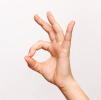
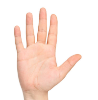
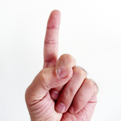
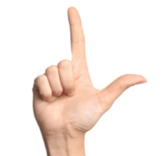
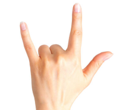
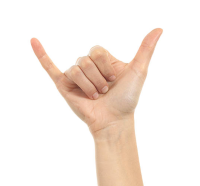
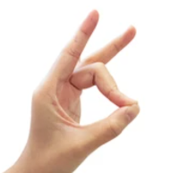

# Wision 

> **Control your computer with hand gestures using your webcam**

Wision is a real-time hand gesture recognition system that lets you control your Windows PC without touching the mouse or keyboard. It uses computer vision and machine learning to track your hand and translate gestures into system actions like cursor movement, clicks, scrolling, window management, and media control.

---

## ✨ Features

- **🎯 Real-time hand tracking** — Uses Google MediaPipe for accurate 21-point hand landmark detection
- **🤌 12 distinct gestures** — Comprehensive gesture vocabulary for varied control options
- **🔄 4 control modes** — Cursor, Scroll, Window, and Media modes for different use cases
- **🖱️ Smooth cursor control** — One Euro Filter algorithm for jitter-free mouse movement
- **⚡ Low latency** — Optimized pipeline for responsive interaction
- **🎨 Visual feedback** — On-screen UI shows current mode and detected gesture
- **🛠️ Testing utility** — Built-in calibration tool for debugging gesture detection

---

## 🎮 Control Modes

Switch between modes using the **OK Sign** gesture (hold for ~0.5 seconds):

| Mode | Purpose | Key Gestures |
|------|---------|--------------|
| **CURSOR** | Mouse control | Point to move, pinch to click, peace sign to scroll |
| **SCROLL** | Dedicated scrolling | Peace sign angle controls scroll direction/speed |
| **WINDOW** | Window management | Open palm = maximize, fist = minimize, rock = Alt+Tab |
| **MEDIA** | Media playback | Open palm = play/pause, point = next, peace = previous |

---

## 🤚 Gesture Reference


| Gesture | Hand Position | Image |
|---------|---------------|-------|
| **OK Sign** | Thumb + index form a circle, other fingers extended |  |
| **Open Palm** | All 5 fingers extended |  |
| **Fist / Grab** | All fingers closed |  |
| **Index Up (Pointing)** | Only index finger extended |  |
| **L Sign** | Thumb + index extended (L shape) |  |
| **Peace Sign** | Index + middle extended (V shape) |  |
| **Rock Sign** | Index + pinky extended, middle + ring curled |  |
| **Call Me** | Thumb + pinky extended |  |
| **Pinch Middle** | Thumb touches middle finger |  |

<details>
<summary><b>📋 Full Gesture-to-Action Mapping</b></summary>

### CURSOR Mode
| Gesture | Action |
|---------|--------|
| Index Up | Move cursor |
| L Sign | Move cursor + Left click |
| Pinch Middle | Left click |
| Rock Sign | Right click |
| Call Me | Double click |
| Peace Sign | Scroll (angle-based) |
| Ring Curl | Middle click |

### SCROLL Mode
| Gesture | Action |
|---------|--------|
| Index Up | Move cursor |
| Peace Sign | Scroll (vertical = up, horizontal = down) |

### WINDOW Mode
| Gesture | Action |
|---------|--------|
| Open Palm | Maximize window (Win+Up) |
| Fist/Grab | Minimize window (Win+Down) |
| Rock Sign | Switch window (Alt+Tab) |
| Pinch Middle | Show desktop (Win+D) |
| Call Me | Close window (Alt+F4) |
| Peace Sign | Take screenshot |

### MEDIA Mode
| Gesture | Action |
|---------|--------|
| Open Palm | Play/Pause |
| Index Up | Next track |
| Peace Sign | Previous track |
| Pinch Middle | Volume up |
| Rock Sign | Volume down |
| Fist/Grab | Mute/Unmute |

</details>

---

## 🚀 Quick Start

### Prerequisites

- **Windows 10/11** (PyAutoGUI uses Windows APIs)
- **Python 3.9+** (tested with 3.11)
- **Webcam** (built-in or external)

### Installation

```bash
# Clone the repository
git clone https://github.com/YOUR_USERNAME/Wision.git
cd Wision

# Create a virtual environment
python -m venv .venv

# Activate it (Windows)
.venv\Scripts\activate

# Install dependencies
pip install -r requirements.txt
```

### Running the Controller

```bash
# Run the main gesture controller
python run_hand.py

# Or run as a module
python -m hand
```

### Testing Gestures (Safe Mode)

The testing utility shows what gestures are detected **without** triggering any system actions. Great for calibration and debugging:

```bash
python test_gestures.py
```

### Controls

- **OK Sign (hold)** — Switch between control modes
- **Q or ESC** — Quit the application

---

## 🏗️ Architecture

```
┌─────────────┐    ┌─────────────┐    ┌─────────────┐    ┌─────────────┐
│   Webcam    │───▶│  Tracker    │───▶│ Recognizer  │───▶│   Actions   │
│  (OpenCV)   │    │ (MediaPipe) │    │  (Rules)    │    │ (PyAutoGUI) │
└─────────────┘    └─────────────┘    └─────────────┘    └─────────────┘
                          │                  │                  │
                          ▼                  ▼                  ▼
                    21 landmarks      Gesture label      OS commands
                    per frame         + stability        (mouse/keys)
```

### Project Structure

```
Wision/
├── hand/                    # Main package
│   ├── __init__.py          # Package exports
│   ├── __main__.py          # Module entry point
│   ├── hand.py              # Documentation + entry point
│   ├── gestures.py          # Gesture/Mode enums and data structures
│   ├── tracker.py           # Hand tracking with MediaPipe
│   ├── recognizer.py        # Gesture classification logic
│   ├── actions.py           # System control via PyAutoGUI
│   ├── smoothing.py         # One Euro Filter for cursor smoothing
│   └── controller.py        # Main application loop
├── run_hand.py              # Quick launcher
├── test_gestures.py         # Gesture testing/calibration utility
├── requirements.txt         # Python dependencies
├── assets/                  # Images and media (create this folder)
│   ├── demo.gif             # Demo recording
│   └── gestures/            # Gesture reference images
└── README.md                # This file
```

---

## 🔧 Configuration

Key parameters can be adjusted in the source files:

| Parameter | File | Default | Description |
|-----------|------|---------|-------------|
| `detection_confidence` | `tracker.py` | 0.7 | Min confidence for hand detection |
| `tracking_confidence` | `tracker.py` | 0.7 | Min confidence for tracking |
| `cursor_sensitivity` | `actions.py` | 2.5 | Cursor movement multiplier |
| `OK_SIGN_THRESHOLD` | `recognizer.py` | 0.05 | Max distance for OK sign detection |
| `PINCH_THRESHOLD` | `recognizer.py` | 0.06 | Max distance for pinch detection |

---

## 📦 Dependencies

| Package | Purpose |
|---------|---------|
| [MediaPipe](https://mediapipe.dev/) | Hand landmark detection (ML model) |
| [OpenCV](https://opencv.org/) | Video capture and image processing |
| [NumPy](https://numpy.org/) | Numerical computations |
| [PyAutoGUI](https://pyautogui.readthedocs.io/) | Mouse/keyboard control |
| [ReportLab](https://www.reportlab.com/) | PDF generation (optional, for docs) |

---

## 🤝 Contributing

Contributions are welcome! Here are some ideas:

- [ ] Add multi-hand support for two-handed gestures
- [ ] Create a GUI for configuration
- [ ] Add gesture recording and custom gesture training
- [ ] Port to macOS/Linux
- [ ] Add voice command integration
- [ ] Improve gesture recognition accuracy with ML

---

## 📝 License

This project is licensed under the MIT License — see the [LICENSE](LICENSE) file for details.

---

## 🙏 Acknowledgments

- [Google MediaPipe](https://mediapipe.dev/) for the hand tracking model
- [One Euro Filter](https://cristal.univ-lille.fr/~casiez/1euro/) algorithm for smooth cursor movement
- The open-source community for inspiration and tools

---

<p align="center">
  Made with ❤️ and 🤚
</p>
